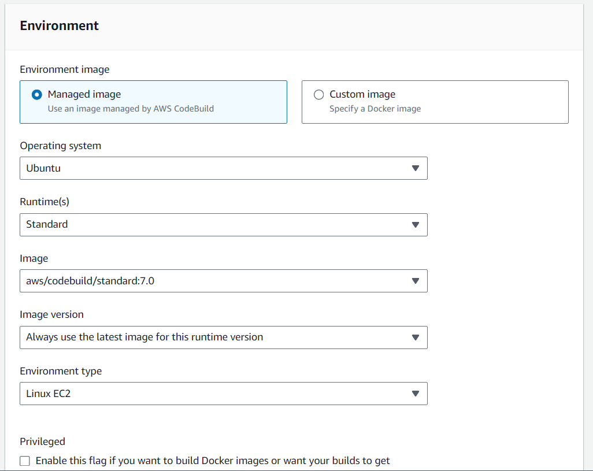

### Create a Repo in AWS
* Log in to AWS Console
* Go to Developer tools > CodeCommit > Repositories
* Create a Reporsitory
* Clone the repository (HTTPS)

### Create an IAM User
* Go to the IAM > User > CreateUser
* Give the suer name and fill other details

### Give access to the User
* Go to the users and add access
* Give acess of 'AWSCodeCommitPowerUser'

### Add Project details to the demo-app folder
* We can add whatever project we want to create
* make git status > git add . > git commit > git push
* The project will be pushed to the CodeCommit of AWS

### Create Build Project
* Go to the AWS Build Project > Create Build Project

* Enter Source details

* Enter environment details

**We have to create a buildspec.yml file as well for below specification**
This is a specification file which instructs the process to be followed while building the project. Basically we have to specify all the pases configuartion like (Install dependencies, Run/test, etc.,) in tis file\

* And finally create a project

### Build the project 
* Go to AWS CodeBuild and finally build the project

